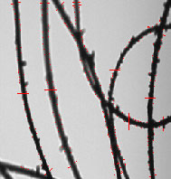
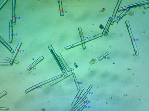
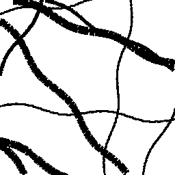

# :microscope: Generador de micrografías artificiales de fibra de alpaca

Ejemplo de fibra OFDA-2000:

[comment]: <> (Ejemplo de fibra Medulómetro:)

[//]: ()

Para esto se crea un algoritmo que dibuje líneas curvas en diferentes ubicaciones y de diferente diámetro o ancho, todo de forma aleatoria.

Ejemplo de micrografía artificial:

